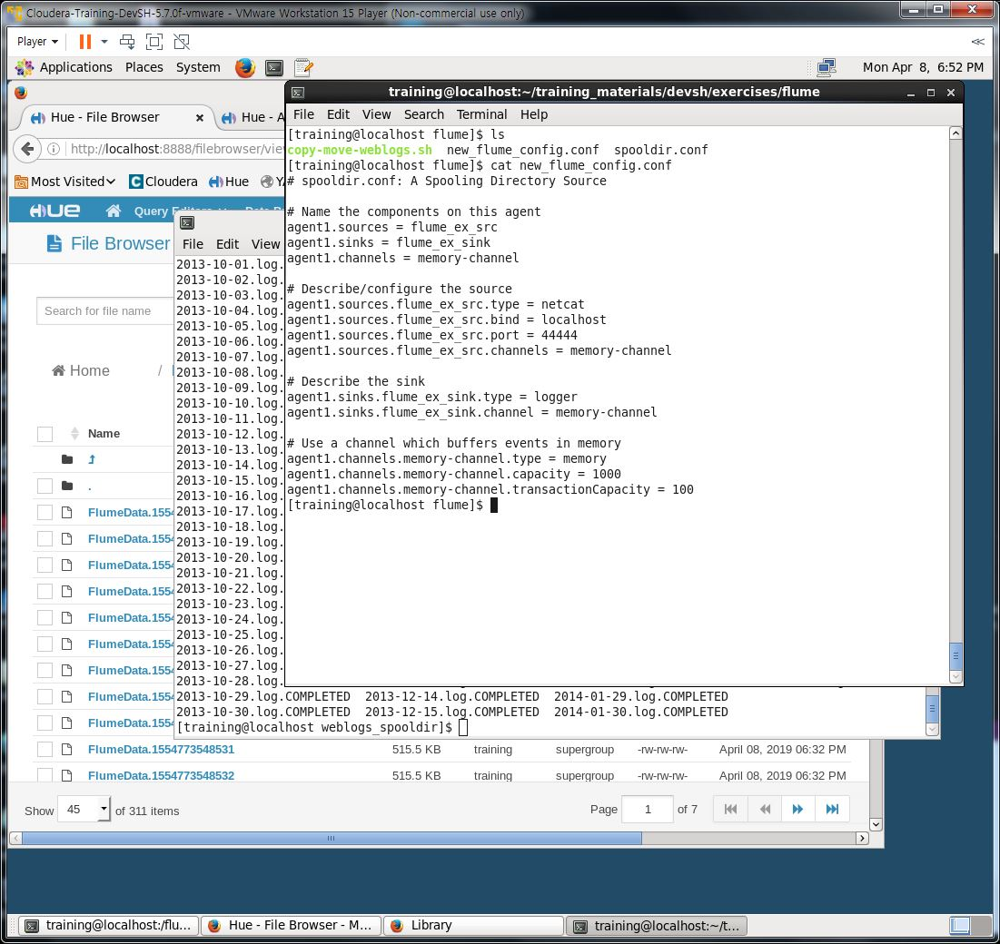
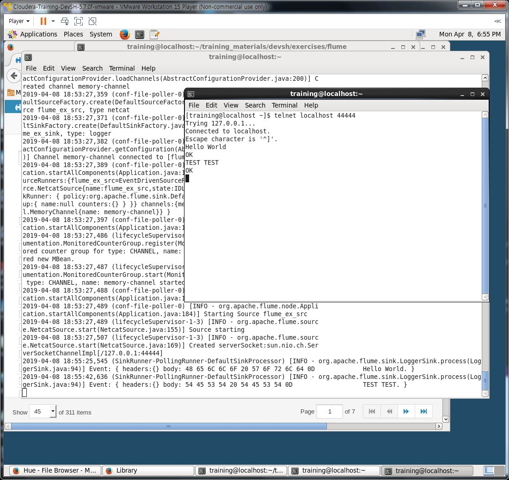

## Flume Hands-on

### 1. Create a new flume configuration file with the following:

<pre>

</pre>

<pre>

</pre>

### 2. Start the agent.

<pre>

</pre>

### 3. From another terminal start telnet and connect to port 4444. Start typing and you should see the results from the other terminal. Provide a screenshot of your results.

<pre>

</pre>

