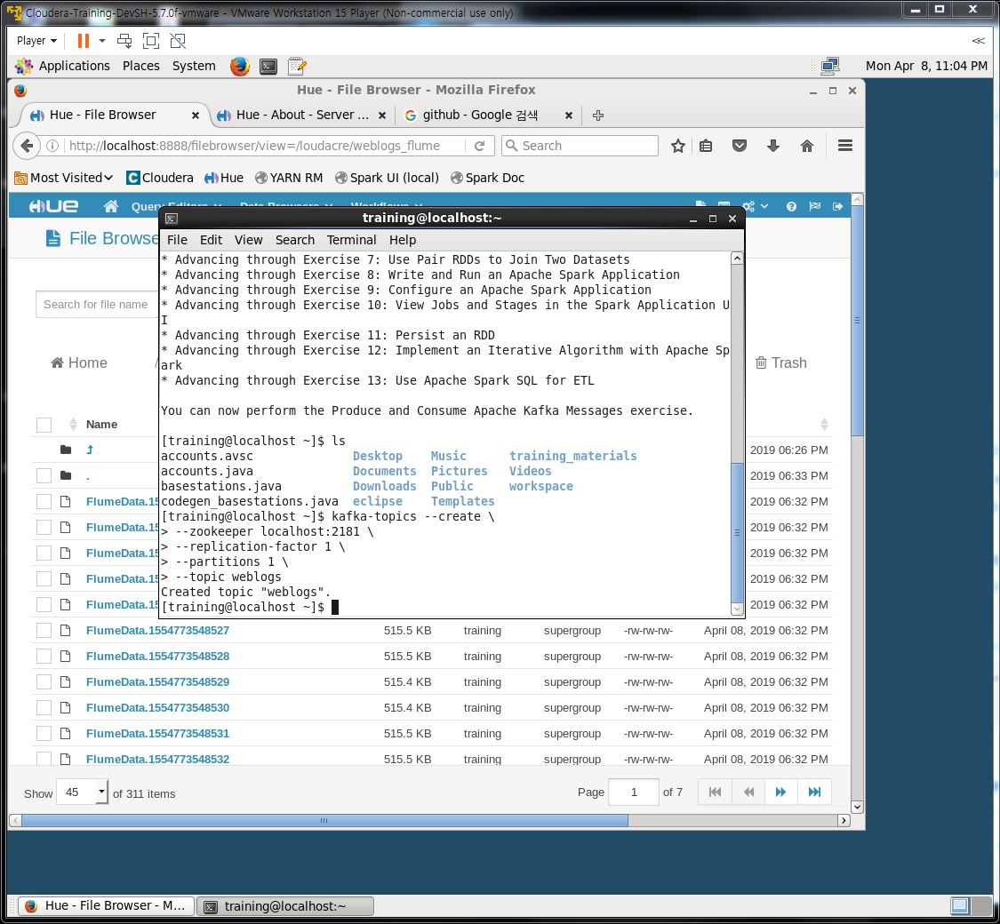
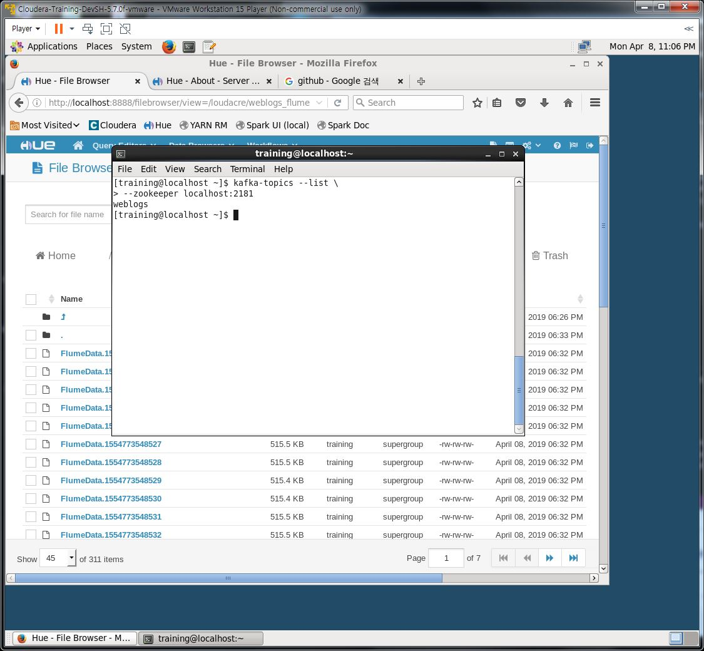
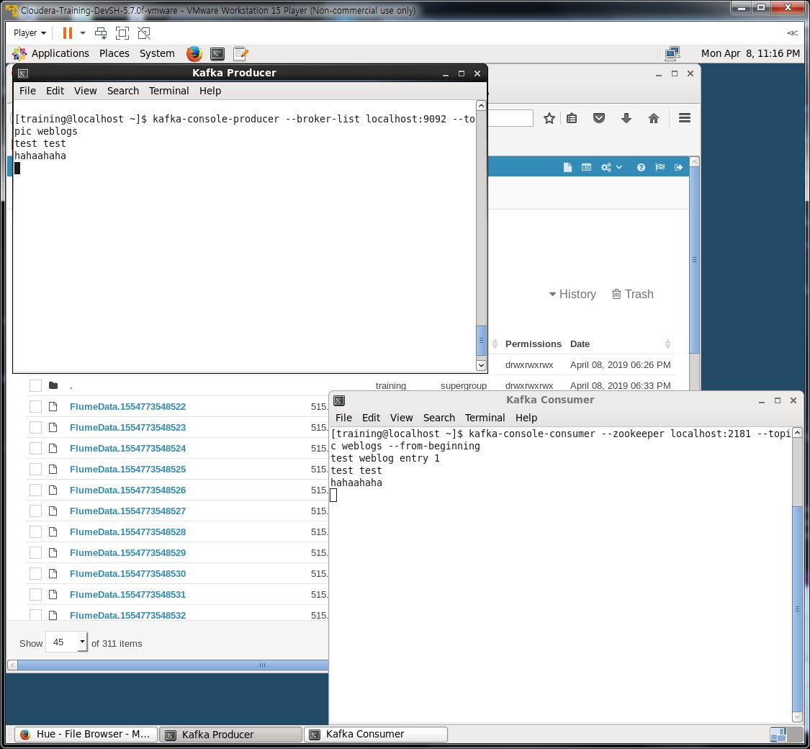
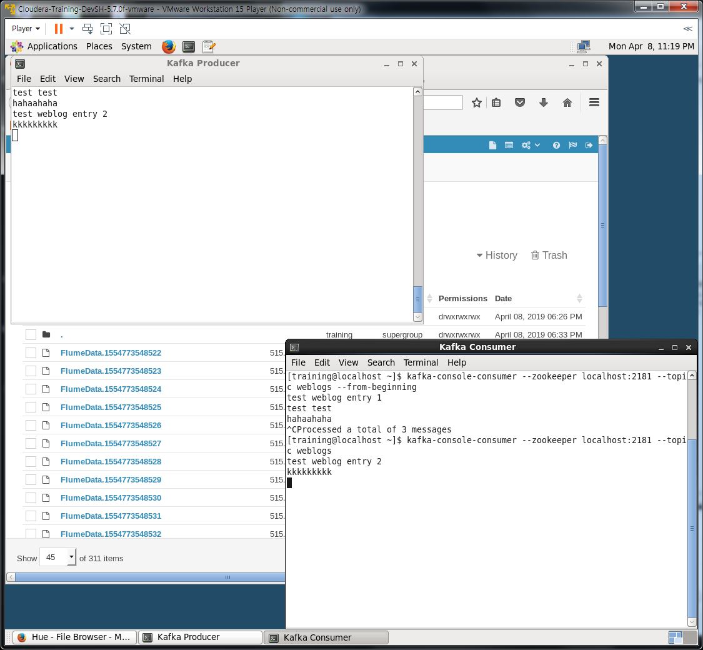

## Kafka Hands-on

### 1. Creating a Kafka Topic

### 2. Display all Kafka topics to confirm that the new topic you just created is listed:

### 3. Review the details of the weblogs topic.

### 4. Producing and Consuming Messages

### 5. Producing and Consuming Messages(without from-beginning)

