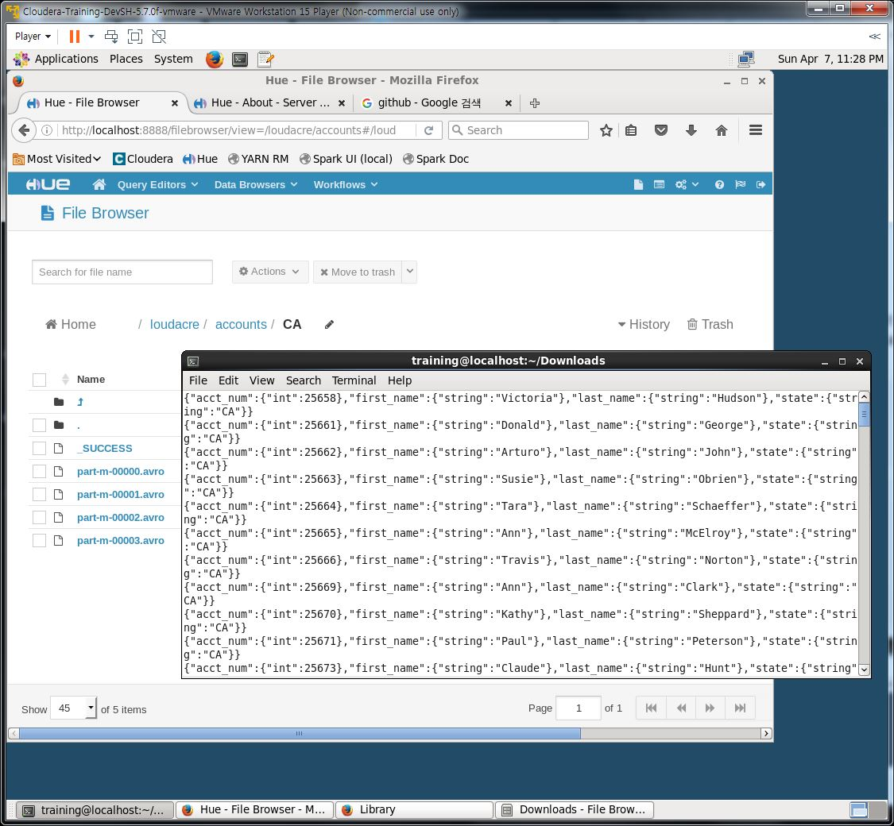

## Sqoop Hands-on

### 1. From the accounts table, import only the primary key, along with the first name, last name to HDFS directory /loudacre/accounts/user_info. Please save the file in text format with tab delimiters.

<pre>
sqoop eval \
--connect jdbc:mysql://localhost/loudacre \
--username training --password training \
--query "DESC accounts"
</pre>

<pre>
sqoop import \
--connect jdbc:mysql://localhost/loudacre \
--username training --password training \
--table accounts \
--target-dir /loudacre/accounts/user_info \
--null-non-string '\\N' \
--columns "acct_num, first_name, last_name" \
--fields-terminated-by "\t"
</pre>

### 2. This time save the same in parquet format with snappy compression. Save it in /loudacre/accounts/user_compressed. Provide.a screenshot of HUE with the new directory created.

<pre>
sqoop import \
--connect jdbc:mysql://localhost/loudacre \
--username training --password training \
--table accounts \
--target-dir /loudacre/accounts/user_compressed \
--null-non-string '\\N' \
--columns "acct_num, first_name, last_name" \
--fields-terminated-by "\t" \
--compression-codec \
org.apache.hadoop.io.compress.SnappyCodec
</pre>

### 3. Finally save in /loudacre/accounts/CA only clients whose state is from California. Save the file in avro format and compressed using snappy. From the terminal, display some of the records that you just imported. Take a screenshot and save it as CA_only.

<pre>
sqoop import \
--connect jdbc:mysql://localhost/loudacre \
--username training --password training \
--table accounts \
--target-dir /loudacre/accounts/CA \
--null-non-string '\\N' \
--columns "acct_num, first_name, last_name, state" \
--where "state='CA'" \
--fields-terminated-by "\t" \
--as-avrodatafile \
--compression-codec snappy
</pre>

<pre>
avro-tools tojson hdfs://localhost/loudacre/accounts/CA/part-m-00000.avro
</pre>

